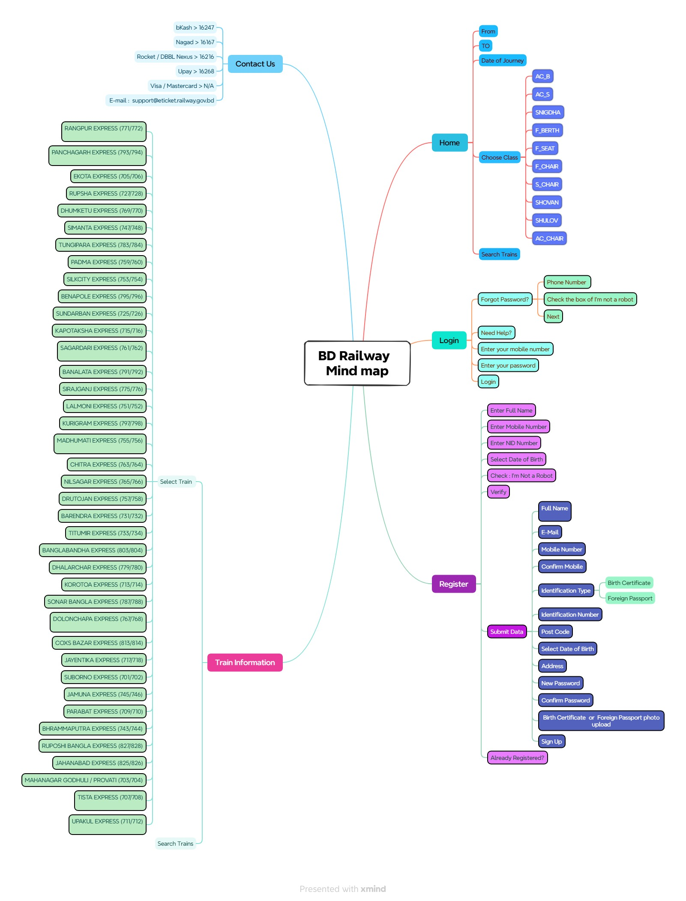

# 🚆 Bangladesh Railway E-Ticketing System — QA Test Suite & Quality Assurance Documentation

[-success?style=for-the-badge&logo=checkmarx)](https://eticket.railway.gov.bd)
[](#-test-execution-summary--metrics)
[](#-test-execution-summary--metrics)
[](https://eticket.railway.gov.bd)
[](https://github.com/TanzimSQA)

A comprehensive, industry-standard Software Quality Assurance (SQA) test documentation suite for the **Bangladesh Railway E-Ticketing System** ([eticket.railway.gov.bd](https://eticket.railway.gov.bd)).

This repository contains full lifecycle testing artifacts including an **IEEE 829 Test Plan**, **System Mind Map**, **232 Manual Test Cases**, **Bug Reports with Severity/Priority Triage**, **Traceability & Test Matrices**, and **Executive Test Metrics**.

---

## 📌 Table of Contents

- [Project Overview](#-project-overview)
- [Target Application](#-target-application)
- [System Mind Map](#-system-mind-map)
- [Scope of Testing](#-scope-of-testing)
- [Test Environment & Tools](#-test-environment--tools)
- [Test Execution Summary & Metrics](#-test-execution-summary--metrics)
- [Module Breakdown](#-module-breakdown)
- [Defect Tracking & Bug Report](#-defect-tracking--bug-report)
- [Test Deliverables Structure](#-test-deliverables-structure)
- [How to Review This Project](#-how-to-review-this-project)
- [Author & Acknowledgements](#-author--acknowledgements)

---

## 📖 Project Overview

The Bangladesh Railway e-Ticketing platform handles millions of passenger searches, reservations, seat selections, and online ticketing transactions across the country. Ensuring platform stability, security, accurate schedule lookup, responsive UI, and seamless form validations is critical for passenger experience.

This testing project delivers an end-to-end quality audit of the live web portal using **Black-Box Testing methodologies**, covering functional workflows, input validation, edge cases, error handling, security checks, and cross-browser responsiveness.

---

## 🌐 Target Application

- **Application Name**: Bangladesh Railway E-Ticketing Portal
- **Live URL**: [https://eticket.railway.gov.bd](https://eticket.railway.gov.bd)
- **Application Type**: High-Traffic Public Transportation E-Commerce Web Application
- **Core Workflows**: Train Search & Availability, Class & Berth Selection, User Registration & NID Verification, User Login & Password Recovery, Contact & Refund Support Information.

---

## 🗺️ System Mind Map

A structured visual breakdown of the application architecture, user flows, train schedule mappings, and verification checkpoints was designed prior to test case authoring:

<p align="center">
  
</p>

### Architecture at a Glance
- **Home / Booking Engine**: Station inputs (`From` / `To`), Date Picker, Class Selection (`AC_B`, `AC_S`, `SNIGDHA`, `F_BERTH`, `F_SEAT`, `F_CHAIR`, `S_CHAIR`, `SHOVAN`, `SHULOV`, `AC_CHAIR`), and Train Search.
- **Login Module**: Mobile Number, Password, Forgot Password (`Phone Number`, `reCAPTCHA`), Help Links.
- **Registration Module**: Two-step flow consisting of Identity Verification (`Full Name`, `Mobile`, `NID`, `DOB`, `reCAPTCHA`) followed by Registration Data Submission (`Email`, `Identification Type`, `Post Code`, `Password`, `ID/Birth Certificate Photo Upload`).
- **Train Information & Schedule**: Detailed route, stoppage, and schedule lookups for over 40 intercity and commuter train services nationwide.
- **Contact Us & Support**: Support hotlines and payment gateway helplines (`bKash`, `Nagad`, `Rocket/DBBL Nexus`, `Upay`, `Visa/Mastercard`, Email Support).

---

## 🎯 Scope of Testing

### In-Scope
- ✅ **Functional Testing**: End-to-end journey search, train route listings, seat class availability, and navigation.
- ✅ **Form & Field Validation**: Name, Bangladeshi 11-digit mobile number, NID formats, email pattern, date of birth constraints.
- ✅ **Boundary Value Analysis (BVA)**: Character limits, boundary date selections, minimum/maximum password length.
- ✅ **Negative Testing**: Invalid inputs, mismatched passwords, unselected station edge cases, same source-destination selection.
- ✅ **Security Testing**: Empty form bypass attempts, reCAPTCHA enforcement, password masking.
- ✅ **UI / UX & Layout Testing**: Grid alignment, placeholder texts, logo & branding display, mobile viewport adaptability.
- ✅ **Cross-Browser Compatibility**: Validated across Chrome, Edge, Firefox, Brave, and Opera Mini.

### Out-of-Scope
- ❌ Internal railway administrative dashboards and backend operational databases.
- ❌ Direct payment settlement clearing via live third-party commercial bank APIs.

---

## 💻 Test Environment & Tools

| Category | Details |
|---|---|
| **Operating System** | Windows 10 & Windows 11 Desktop PC |
| **Browsers Tested** | Google Chrome, Mozilla Firefox, Microsoft Edge, Brave, Opera Mini |
| **Test Case Management** | Microsoft Excel (Card Style Design & Formatted Traceability Grid) |
| **Mind Mapping Tool** | XMind |
| **Inspection Tools** | Chrome DevTools (Console, Elements, Network, Device Emulation) |
| **Version Control** | Git & GitHub |

---

## 📊 Test Execution Summary & Metrics

All test cases were executed and measured against predefined entry and exit criteria.

### Key Performance Indicators (KPIs)

```
┌───────────────────────────────────────────────────────────────┐
│                    TEST EXECUTION SUMMARY                     │
├──────────────────────────┬──────────┬─────────────────────────┤
│ Metric                   │ Count    │ Percentage              │
├──────────────────────────┼──────────┼─────────────────────────┤
│ Total Test Cases Written │ 232      │ 100.00 %                │
│ Test Cases Executed      │ 225      │  96.98 %                │
│ Test Cases Not Executed  │   7      │   3.02 % (Out of Scope) │
├──────────────────────────┼──────────┼─────────────────────────┤
│ Passed Test Cases        │ 222      │  98.67 % (of Executed)  │
│ Failed Test Cases (Bugs) │   3      │   1.33 % (of Executed)  │
│ Blocked Test Cases       │   0      │   0.00 %                │
└──────────────────────────┴──────────┴─────────────────────────┘
```

> **Execution Rate**: **96.98%** (225 / 232 executed).  
> **Pass Rate**: **98.67%** of executed test scenarios successfully passed.

---

## 📂 Module Breakdown

| Module / Feature Area | Total Test Cases | Primary Testing Focus |
|---|:---:|---|
| **Train Information & Schedule** | 149 | Route availability, train number lookup, stops & timing accuracy |
| **Mobile Number Input** | 11 | Format validation, digit length, BD prefix rules, boundary checks |
| **UI & Layout / Navigation** | 17 | Logo display, navigation bar redirects, responsive cards, placeholders |
| **Registration Module** | 20 | Full Name, Password, NID, Date of Birth, Verification button |
| **Authentication / Login** | 4 | Credential validation, session entry, error prompts |
| **Security & reCAPTCHA** | 4 | Bot prevention, submission blocking without captcha |
| **Train Search & Station Selection** | 7 | Origin/Destination dropdowns, same-station error, date selection |
| **Refund & Helpline Support** | 5 | Gateway shortcode displays, dial link functionality, layout |
| **Reserved / Out of Scope** | 7 | Additional boundary & non-functional placeholders (TC-226 to 232) |
| **Total** | **232** | |

---

## 🐞 Defect Tracking & Bug Report

Five defects were documented, triaged, and tracked during test execution:

| Bug ID | Test Case ID | Module | Defect Summary / Steps | Severity | Priority | Status |
|:---:|:---:|---|---|:---:|:---:|:---:|
| `BUG_01` | **TC-070** | Registration & Submit | **Blank form bypasses validation**: Form submits and redirects to next page when Full Name, Mobile, and NID are blank and reCAPTCHA is unchecked. | **Critical** | **High** | `Open` |
| `BUG_02` | **TC-005** | From Station | **Missing empty-state feedback**: Dropdown displays no "Station not found" prompt when an invalid station name (`XYZStation123`) is typed. | **Medium** | **Medium** | `Open` |
| `BUG_03` | **TC-007** | Station Selection | **Sticky validation modal**: Same station validation error modal persists on the screen even after changing the destination station; requires full page reload. | **Medium** | **Medium** | `In Review` |
| `BUG_04` | **TC-222** | Refund Support | **Missing `tel:` URI protocol**: bKash helpline number `16247` is rendered as plain text without clickable `tel:` anchor integration on mobile view. | **Low** | **Low** | `Open` |
| `BUG_05` | **TC-225** | Refund Support | **Label formatting misalignment**: Upay helpline number label text wraps awkwardly, breaking table row height consistency. | **Low** | **Low** | `Resolved` |

---

## 📑 Test Deliverables Structure

All deliverables are bundled in the repository workbook:  
[`Bangladesh_Railway_Cases_Final_CardStyle.xlsx`](./Bangladesh_Railway_Cases_Final_CardStyle.xlsx)

```
Bangladesh_Railway_Cases_Final_CardStyle.xlsx
├── 📄 Sheet 1: Test Plan          # IEEE 829 Compliant Test Strategy & Scope
├── 📄 Sheet 2: Mind Map           # Visual System Architecture & Flow Diagram
├── 📄 Sheet 3: Test Cases         # 232 Formatted Card-Style Test Cases
├── 📄 Sheet 4: Bug Report         # Detailed Defect Logs with Steps & Severity
├── 📄 Sheet 5: Test Matrix        # Execution %, Defect Metrics & Formulas
├── 📄 Sheet 6: Test Case Report   # Executive Sign-Off & Status Overview
└── 📄 Sheet 7: Test Metrics       # High-Level Testing Metric Summaries
```

---

## 🔍 How to Review This Project

1. **Clone the Repository**:
   ```bash
   git clone https://github.com/TanzimSQA/bangladesh-railway-qa-test-cases.git
   cd bangladesh-railway-qa-test-cases
   ```

2. **Inspect the Test Artifacts**:
   - Open [`Bangladesh_Railway_Cases_Final_CardStyle.xlsx`](./Bangladesh_Railway_Cases_Final_CardStyle.xlsx) in Microsoft Excel, WPS Office, or Google Sheets.
   - Navigate through the sheet tabs:
     - Check **Test Plan** for governance, entry/exit criteria, and suspension conditions.
     - Review **Mind Map** for the end-to-end component mapping.
     - Browse **Test Cases** to examine test scenarios, test steps, test data, and actual vs expected results.
     - Inspect **Bug Report** to see how defects were documented with reproduction steps.

---

## 👤 Author & Acknowledgements

- **SQA Engineer**: **Tanzim Rahman**  
  - 🌐 GitHub: [@TanzimSQA](https://github.com/TanzimSQA)  
  - 📧 Email: [tanzimsqa@gmail.com](mailto:tanzimsqa@gmail.com)
- **Reviewed By**: **Md Rubel Hossain**  
- **Test Timeline**: August 26, 2026 – August 28, 2026

---

<p align="center">
  <i>Crafted with precision for Quality Assurance & Excellence in Software Testing.</i>
</p>
